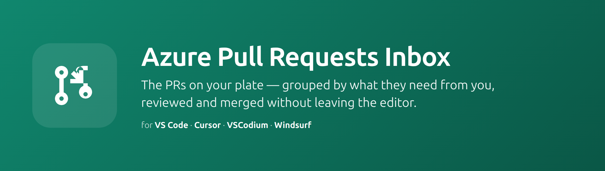
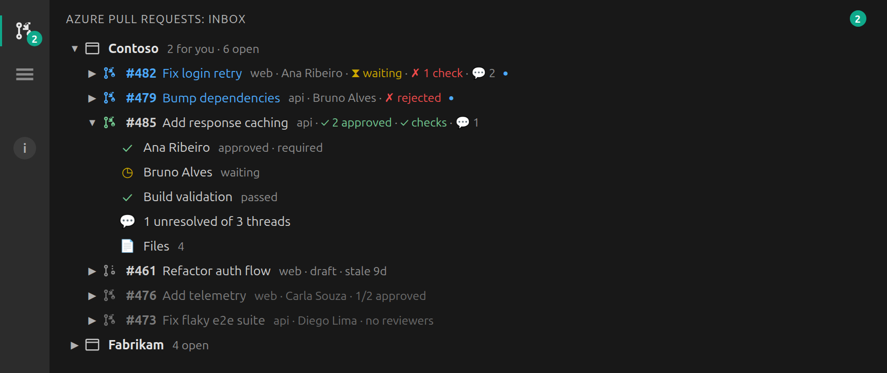
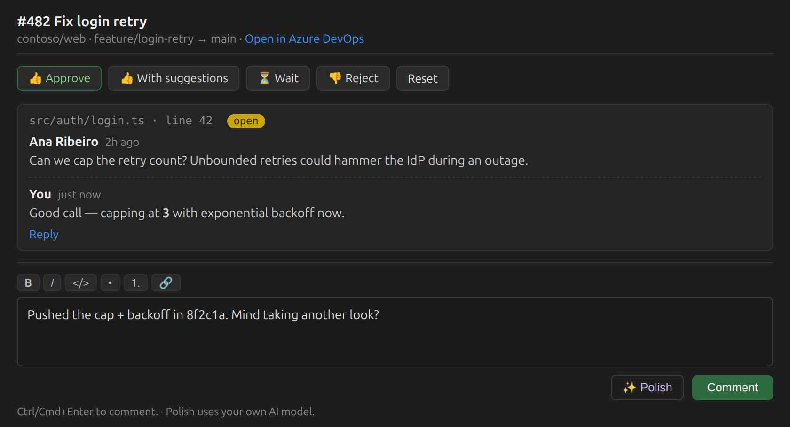
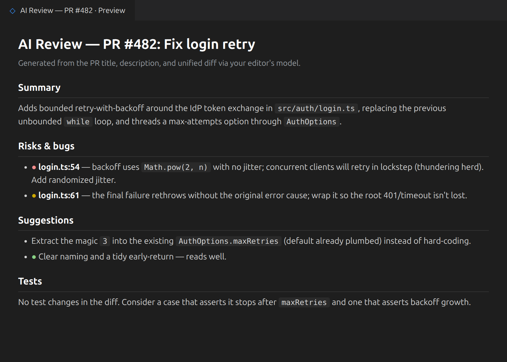

# Azure Pull Requests Inbox

[](https://marketplace.visualstudio.com/items?itemName=danilocolombi.azure-pull-requests-inbox)
[](https://open-vsx.org/extension/danilocolombi/azure-pull-requests-inbox)
[](LICENSE)



**Your team's Azure DevOps pull requests, in VS Code's sidebar — with the ones on your plate
impossible to miss.**

The whole board, triaged for you. Every active pull request in the projects you subscribe to,
grouped by project — PRs that **need your review** float to the top with a blue highlight and
badge, **your own PRs** come next, and everyone else's sit dimmed below, there when you want to
browse what the team is shipping. Each row shows live status at a glance: author, votes,
branch-policy/check results, unresolved comment count, and merge-conflict state. Expand a PR to
see reviewers, checks, and threads inline; open the conversation panel to read and reply. Vote,
comment, and complete or abandon — right from the editor.

This is the pull-request sibling to
[Azure Boards Inbox](https://marketplace.visualstudio.com/items?itemName=danilocolombi.azure-boards-inbox)
and
[Azure Pipelines Inbox](https://marketplace.visualstudio.com/items?itemName=danilocolombi.azure-pipelines-inbox),
and shares their stack and conventions.

## Features

- **Every PR, yours highlighted** — all active pull requests in every subscribed project, grouped
  by project. Ones needing your review are pinned to the top in blue with a ● badge, your own PRs
  follow, and the rest are dimmed for browsing. The activity-bar badge and status bar count only
  what's waiting on your review.
- **Status at a glance** — each row shows `repo · author · status · votes · checks · 💬 unresolved`,
  with draft, conflict, and stale markers. Icons turn green/red/orange as votes and checks land.
- **Expand for detail** — reviewers and their votes, branch-policy/build checks, a thread
  summary, and a **Files** group listing every changed file; click one to open a native VS Code
  side-by-side diff against the PR's merge base (just like Azure's web "Files" tab).
- **Review with AI** — one click bundles the PR (title, description, and the diff) and gets an
  AI review (summary, risks, suggestions, tests) using your editor's own model (Copilot via
  `vscode.lm`, or any OpenAI-compatible endpoint you configure). Or **Copy PR for AI** to hand
  the bundle to Claude Code / Copilot Chat yourself.
- **Conversation panel** — read the discussion (rendered Markdown), reply to a thread or start a
  new one, with a Markdown composer, live preview, and optional **Polish with AI** using your
  own model (Copilot via `vscode.lm`, or any OpenAI-compatible endpoint you configure).
- **Vote & finish from the editor** — Approve / Approve with suggestions / Wait / Reject / Reset,
  plus Complete (merge) and Abandon for your own PRs.
- **Read-only by default** — sign in with a read-only token; the extension only asks for a
  **Code (Read & Write)** token the first time you take a write action.
- **Desktop notifications** — a toast when a new PR lands in your review queue, or when your own
  PR is approved or gets changes requested (configurable: off / mine / all).
- **Works in Cursor, VSCodium, Windsurf** — published to the VS Code Marketplace and Open VSX.

## See it

**The inbox** — every PR in your projects, live, with the ones that need you on top. Expand one
for reviewers, checks, threads, and changed files.



**Read & reply** — the conversation panel renders the discussion, with a vote bar and a Markdown
composer (live preview + optional Polish with AI).



**Review with AI** — bundle the PR and its diff and get a structured review in a Markdown preview,
using your editor's own model.



> Illustrative renders of the extension's UI.

## Quick start

1. Click the **Azure Pull Requests** icon in the activity bar → **Sign in**.
2. Paste your organization URL (e.g. `https://dev.azure.com/contoso`) and a Personal Access
   Token. A read-only token (**Code: Read** + **Project and Team: Read**) is enough to browse,
   review, and get notified.
3. **Manage Subscriptions** and pick the projects whose pull requests you want to see.

To vote, comment, or complete a PR, just do it — the first write action prompts you to swap in a
**Code (Read & Write)** token (a superset, so all read features keep working).

## Settings

| Setting | Default | Description |
| --- | --- | --- |
| `azurePullRequests.organizationUrl` | `""` | Azure DevOps organization URL. |
| `azurePullRequests.subscriptions` | `[]` | Subscribed projects (managed via the command). |
| `azurePullRequests.reviewIncludeVoted` | `false` | Keep PRs highlighted as needing your review after you've voted. |
| `azurePullRequests.includeDrafts` | `true` | Show draft PRs; off hides all drafts. |
| `azurePullRequests.pollSeconds` | `30` | Refresh interval while the inbox is visible (min 10). |
| `azurePullRequests.notifyOnPr` | `mine` | Desktop notifications: `off` / `mine` / `all`. |
| `azurePullRequests.enableActions` | `false` | Set automatically after your first successful write action. |
| `azurePullRequests.ai.baseUrl` | `""` | OpenAI-compatible base URL for *Polish with AI*. |
| `azurePullRequests.ai.model` | `""` | Model id for the *Polish with AI* fallback. |
| `azurePullRequests.staleAfterDays` | `7` | Flag PRs with no activity for this many days (0 = off). |

## How it works

Azure DevOps has no public push API, so — like its own web UI — this extension polls. While the
inbox is visible it re-fetches every active PR in each subscribed project (one paged
`getPullRequestsByProject` call per project, which returns reviewers and votes inline) and works
out your relationship to each PR locally. Branch-policy checks and unresolved-comment counts are
filled in in the background for the PRs that concern you; other rows fetch them when expanded.
Polling stops when the view is hidden. All data goes through
[`azure-devops-node-api`](https://www.npmjs.com/package/azure-devops-node-api); your PAT is kept
in VS Code's encrypted `SecretStorage`.

## Development

```sh
npm install
npm run build      # esbuild production bundle → dist/extension.js
npm run watch      # esbuild watch; required for F5 Extension Development Host
npm run compile    # tsc --noEmit — the type-check (esbuild does not type-check)
npm run lint
```

Press **F5** to launch the Extension Development Host.

## License

MIT
